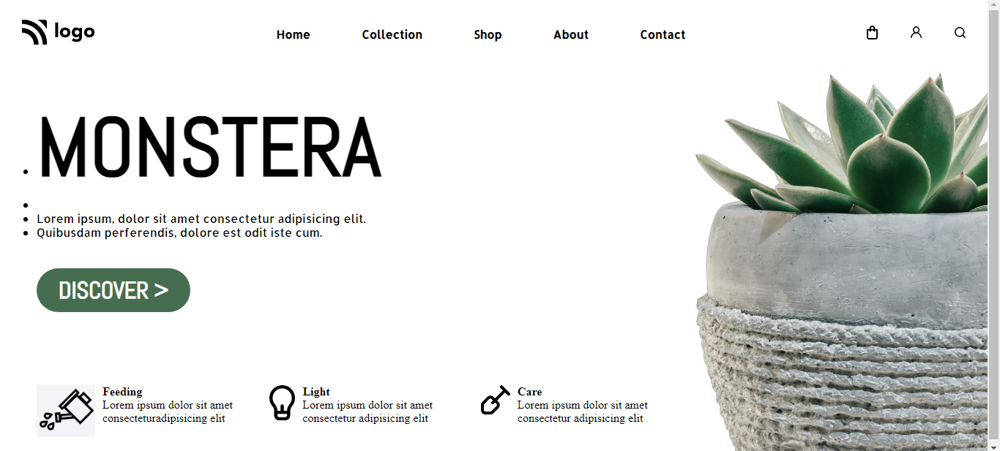

# Plantation Website Landing Page

>This is the landing page of a Plantation nursery website built purely in HTML and CSS

- This one is really a good project to learn building good looking and interactive landing pages😉. Especially the font and color combination used make it look even better and professional😎.

- Key learning are as follows:
    - In depth understanding of `CSS Flexbox`
    - Image position manipulation
    - Navbar styling using `Flexbox` and `Positions`

Below is the link and the view of the page👇👇
 

